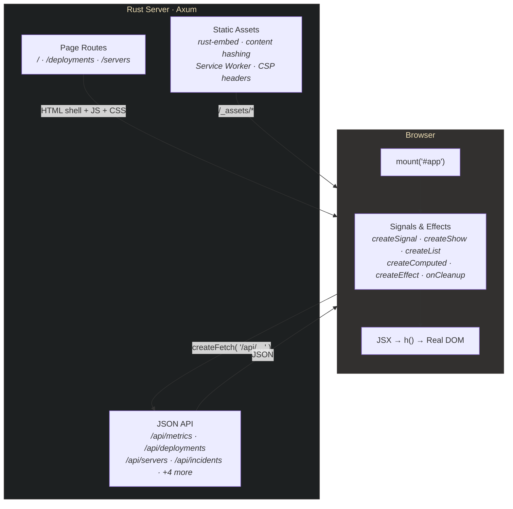
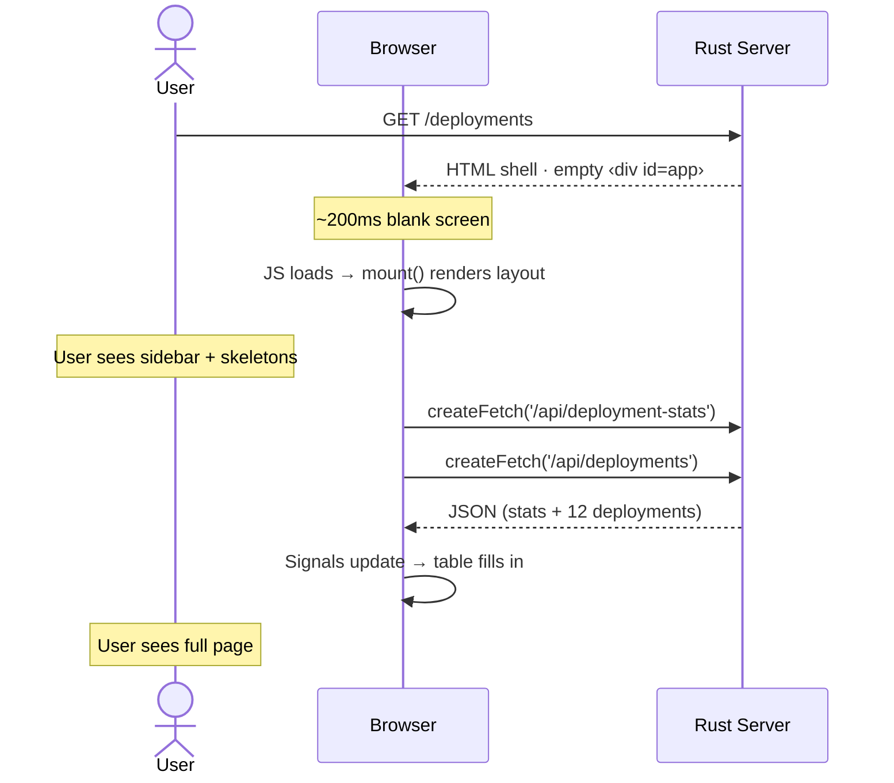
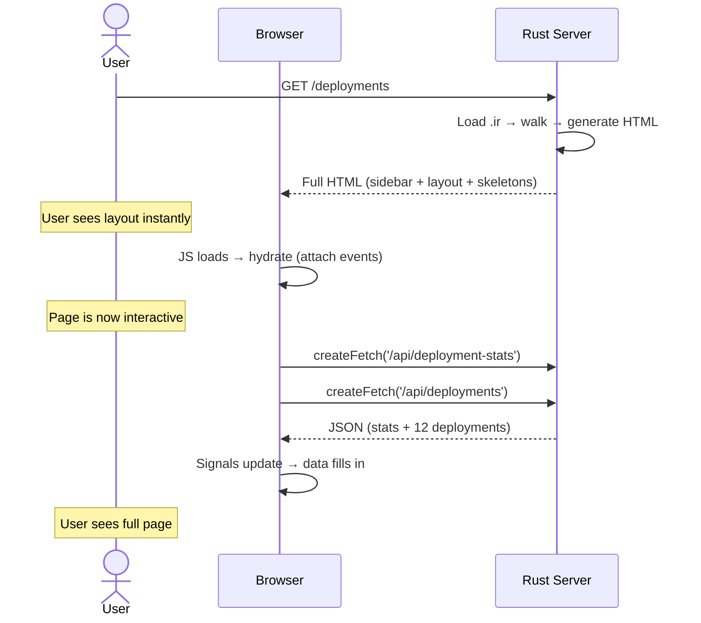

# FormaOps Dashboard

A production-grade DevOps admin panel built with [Forma Stack](https://getforma.dev) — Rust + FormaJS + Tailwind CSS.

This template demonstrates that Forma Stack can build real, complex applications. Everything you see — the interactive charts, real-time data tables, sidebar navigation, command palette — is built with FormaJS's reactive primitives. No React. No virtual DOM. Just signals and the real DOM.

## Quick Start

```bash
# Build the frontend
cd admin && npm install && npm run build && cd ..

# Start the Rust server
cargo run
```

Open [http://localhost:3000](http://localhost:3000)

---

## What's Inside

### Pages

| Page | URL | What It Shows |
|------|-----|---------------|
| **Overview** | `/` | Stat cards, interactive SVG chart, service status grid, recent deployments, active incidents |
| **Deployments** | `/deployments` | 4 stat cards, searchable deployment history table with 12 rows, status/environment badges |
| **Servers** | `/servers` | Server fleet grid with status filter tabs (All/Online/Degraded/Offline), CPU/Memory/Disk progress bars |

### Features

- **Client-side routing** via `createSignal` + `createShow` + History API (no router library)
- **Command palette** (Cmd+K / Ctrl+K) with page search and navigation
- **Interactive SVG chart** — hand-rolled with `h('svg', ...)`, hover tooltip with success/error counts
- **Deployment table search** — debounced filtering across all columns
- **Server fleet filtering** — reactive computed filter with tab counts
- **Loading skeletons** — pulse-animated placeholder cards on every page
- **Error states** — graceful fallbacks when API calls fail
- **Deploy toast** — "New Deploy" button triggers a neon-glow notification
- **Collapsible sidebar** — grouped navigation with SVG icons from Iconify/Lucide
- **Dark theme** — Gruvbox palette with Neon Green (#39FF14) accent
- **16 Playwright E2E tests** — navigation, data rendering, filtering, API validation

---

## Architecture



### Frontend (TypeScript + JSX)

```
admin/src/
├── app.tsx                    Layout, Sidebar, TopBar, routing, command palette
├── pages/
│   ├── DeploymentsPage.tsx    Stat cards + searchable deployment table
│   ├── OverviewPage.tsx       Stats, SVG chart, service status, incidents
│   ├── ServersPage.tsx        Fleet grid with filter tabs + progress bars
│   └── SettingsPage.tsx       Placeholder
├── components/
│   ├── Icon.tsx               SVG icon wrapper (multi-path support)
│   ├── icons.ts               Lucide SVG path constants (25 icons)
│   ├── StatCard.tsx           Metric card with trend arrow
│   ├── StatusBadge.tsx        Color-mapped status badge (20 status types)
│   ├── ProgressBar.tsx        Threshold-colored bar (green/yellow/red)
│   └── UserAvatar.tsx         Initials avatar circle
└── styles/
    └── dashboard.css          Tailwind v4 @theme + custom animations
```

### Backend (Rust)

```
src/
├── main.rs                    Axum server — 8 API routes + SPA routing
└── data.rs                    8 structs with mock data (replace with your DB)
```

### API Endpoints

| Route | Response | Description |
|-------|----------|-------------|
| `GET /api/metrics` | `Metric[]` | Overview stat cards (uptime, latency, load, deploy rate) |
| `GET /api/deployment-stats` | `DeploymentStats` | Deployments page stat cards (today's deploys, success rate, etc.) |
| `GET /api/deployments` | `Deployment[]` | 12 deployment records with service, version, branch, env, status |
| `GET /api/servers` | `Server[]` | 8 servers with CPU/memory/disk metrics |
| `GET /api/services` | `Service[]` | 8 services with health status and latency |
| `GET /api/service-summary` | `ServiceStatusSummary` | Aggregate counts (healthy/degraded/down) |
| `GET /api/request-volume` | `RequestVolumePoint[]` | 24 hourly data points for the SVG chart |
| `GET /api/incidents` | `Incident[]` | 5 incidents with severity and status |

---

## FormaJS Patterns Used

This template showcases FormaJS's core reactive primitives in a real application. Here's how each one is used:

### JSX via `h()`

FormaJS uses standard JSX syntax. The TypeScript compiler transforms `<div>` into `h('div', ...)` via `jsxFactory: 'h'` in `tsconfig.json`. No virtual DOM — `h()` creates real DOM elements directly.

```tsx
// This JSX:
<div class="flex items-center gap-2">
  <StatusBadge status="success" dot={true} />
  <span>{deployment.service}</span>
</div>

// Compiles to:
h('div', { class: 'flex items-center gap-2' },
  h(StatusBadge, { status: 'success', dot: true }),
  h('span', null, deployment.service),
)
```

### Function Components

Every page and reusable component is a function that receives props and returns JSX:

```tsx
export function StatCard({ label, value, change, index = 0 }: StatCardProps) {
  return (
    <div class="bg-gruvbox-bg-soft border border-gruvbox-border rounded-lg p-5"
         style={`animation-delay: ${index * 80}ms`}>
      <div class="text-xs text-gruvbox-gray">{label}</div>
      <div class="font-mono text-3xl text-gruvbox-blue">{value}</div>
    </div>
  );
}
```

### `createSignal` — Reactive State

Used for page routing, sidebar collapse, search input, and filter tabs:

```tsx
const [currentPage, setCurrentPage] = createSignal('overview');
const [collapsed, setCollapsed] = createSignal(false);
const [search, setSearch] = createSignal('');
```

### `createShow` — Conditional Rendering

Swaps DOM nodes based on a boolean condition. Used for page routing, loading/error states, and collapsed sidebar elements:

```tsx
// This IS the router — no library needed
createShow(() => currentPage() === 'deployments', () => <DeploymentsPage />)

// Loading skeleton
createShow(() => stats.loading() && !stats.data(), () => <Skeleton />)

// Error fallback
createShow(() => !!stats.error(), () => <ErrorMessage />)
```

### `createList` — Keyed List Rendering

Efficient keyed reconciliation for dynamic lists. Used for deployment table rows and server cards:

```tsx
createList(
  () => deployments.data() || [],     // reactive data source
  (dep) => dep.id,                     // key function
  (dep, i) => (                        // render function (i is an accessor)
    <tr style={`animation-delay: ${i() * 30}ms`}>
      <td>{dep.service}</td>
      <td><StatusBadge status={dep.status} dot={true} /></td>
    </tr>
  ),
)
```

### `createFetch` — Reactive Data Fetching

Fetches JSON from API endpoints with built-in loading, error, and data signals:

```tsx
import { createFetch } from '@getforma/core/http';  // subpath import!

const stats = createFetch<DeploymentStats>('/api/deployment-stats');
// stats.data()    → DeploymentStats | null
// stats.loading() → boolean
// stats.error()   → Error | null
// stats.refetch() → re-trigger the fetch
```

**Important:** `createFetch` lives at `@getforma/core/http`, NOT in the main `@getforma/core` bundle. The main bundle has zero network code.

### `createEffect` — Side Effects

Runs when its dependencies change. Used to sync the routing signal with the browser URL:

```tsx
createEffect(() => {
  const page = currentPage();
  const path = '/' + (page === 'overview' ? '' : page);
  if (location.pathname !== path) {
    history.pushState(null, '', path);
  }
});
```

### `createComputed` — Derived State

Creates a read-only signal derived from other signals. Used for filtered server lists and status counts:

```tsx
const filtered = createComputed(() => {
  const list = servers.data();
  if (!list) return [];
  const f = filter();
  return f === 'all' ? list : list.filter(s => s.status === f);
});
```

### `onCleanup` — Resource Disposal

Runs when the reactive scope is disposed. Used to remove event listeners:

```tsx
window.addEventListener('popstate', onPopState);
onCleanup(() => window.removeEventListener('popstate', onPopState));
```

### Reactive Class Bindings

`h()` supports function-valued `class` attributes that update reactively:

```tsx
<button class={() => {
  const base = 'px-3 py-2 rounded-md text-sm font-medium';
  return currentPage() === id
    ? `${base} bg-white/10 text-forma-green`
    : `${base} text-gruvbox-gray hover:text-gruvbox-fg`;
}} />
```

### SVG via `h()`

`h()` handles SVG elements natively — same API, automatic namespace detection. This is how the interactive chart is built with zero charting dependencies:

```tsx
<svg viewBox="0 0 600 200" class="w-full h-auto">
  <defs>
    <linearGradient id="grad" x1="0" y1="0" x2="0" y2="1">
      <stop offset="0%" stop-color="#83a598" stop-opacity="0.25" />
    </linearGradient>
  </defs>
  <path d={areaPath} fill="url(#grad)" />
  <polyline points={linePoints} stroke="#83a598" fill="none" />
</svg>
```

---

## Styling: Tailwind CSS v4

Tailwind handles ALL layout, spacing, typography, and responsive design. Custom CSS is limited to neon glow effects, `@keyframes` animations, and scrollbar styling.

Tailwind v4 uses `@theme` blocks in CSS (no `tailwind.config.js`):

```css
@import "tailwindcss";

@theme {
  --color-forma-green: #39FF14;
  --color-gruvbox-bg: #282828;
  --color-gruvbox-bg-soft: #32302f;
  --color-gruvbox-fg: #ebdbb2;
  --color-gruvbox-blue: #83a598;
  --color-gruvbox-red: #fb4934;
  /* ... full Gruvbox palette */
}
```

This gives you utilities like `bg-gruvbox-bg-soft`, `text-forma-green`, `border-gruvbox-border`.

---

## Routing Without a Router

The entire navigation system is 15 lines:

```tsx
const [currentPage, setCurrentPage] = createSignal('overview');

// Signal → URL bar
createEffect(() => {
  history.pushState(null, '', '/' + currentPage());
});

// URL → Signal (back/forward)
window.addEventListener('popstate', () => {
  setCurrentPage(location.pathname.slice(1) || 'overview');
});

// View switching
createShow(() => currentPage() === 'overview', () => <OverviewPage />);
createShow(() => currentPage() === 'deployments', () => <DeploymentsPage />);
```

Sidebar buttons call `setCurrentPage('deployments')`. No library, no dependency, no configuration.

---

## Phase 1 vs Phase 2: The SSR Upgrade Path

This template ships as **Phase 1** (client-side rendering). Here's what that means and what it takes to upgrade.

### Phase 1: Client-Side Mount (Current)



The server returns `<div id="app"></div>` with a script tag. JavaScript renders everything. A `personality_css` rule sets `background: #282828` immediately so there's no white flash, but the layout only appears after JS executes (~200ms).

### Phase 2: Server-Side Rendering + Hydration



### How SSR Works Under the Hood

1. **Build time:** The FMIR compiler reads your JSX and emits `.ir` files — a binary intermediate representation of your component tree's static structure.

2. **Request time:** The Rust server's `forma-server` crate loads `.ir` files and walks them to generate HTML. This is a Rust-native renderer — no JavaScript on the server.

3. **Browser:** FormaJS detects `data-forma-ssr` on `#app` and enters hydration mode. It walks the existing DOM and attaches reactive bindings (event listeners, signal subscriptions) in place — no DOM re-creation.

4. **Service Worker:** Precaches all assets. On repeat visits, the SW serves cached HTML instantly — works offline.

### What Phase 2 Can and Cannot Render

The FMIR compiler generates `.ir` from your JSX's **static structure** — the layout, component tree, and initial DOM shape. It does not execute JavaScript, so:

**Server renders (instant):**
- Sidebar navigation with all icons and labels
- TopBar with page title and command palette hint
- Card grid layout and loading skeleton placeholders
- Table headers, structural elements, static text

**Client fills in after hydration:**
- Data from `createFetch` (stat card values, table rows, chart data)
- Interactive state (`createSignal`, `createComputed`)
- Imperative DOM (the SVG chart tooltip, `document.createElement` patterns)
- History API integration

In practice, Phase 2 gives you **instant layout + loading skeletons** on first paint, then JS hydrates and `createFetch` fills in the real data. The user sees a complete page structure immediately instead of a blank screen — but the actual data still requires client-side fetching.

For fully server-rendered data (stat card values baked into HTML), you'd pass server-side data through the `slots` mechanism in `render_page()`. This is a more advanced pattern demonstrated in the GateWASM reference implementation.

### Upgrading to Phase 2

The build pipeline is configured to pass the SSR flag:

```bash
# Build with SSR flag
cd admin && npm run build:ssr

# Restart the server
cd .. && cargo run
```

The compiler analyzes your JSX, extracts the static layout structure, and emits a 1,956-byte IR file with 7 islands. The Rust server renders the layout (sidebar frame, topbar, content area, command palette shell) as HTML. Dynamic content (nav items, stat cards, table rows) hydrates client-side via islands.

**Structuring components for SSR:**
- Declarative JSX layout (sidebar, topbar, page shells) → server-rendered
- `createShow` branches → become hydration boundaries (show markers in HTML)
- `createFetch` → fires client-side after hydration
- Local closures (`navItem`, `sectionTitle`) → become islands, hydrated client-side
- `createEffect`, `addEventListener` → skipped during static analysis (client-only)

| Aspect | Phase 1 | Phase 2 |
|--------|---------|---------|
| First paint | ~200ms (JS must execute) | Instant (layout + skeletons) |
| Page source | `<div id="app"></div>` | Full layout HTML |
| Data rendering | After JS + fetch | After JS + fetch (same) |
| Offline | No | Yes (Service Worker caches HTML) |
| SEO | No (empty div) | Partial (layout, not data) |
| Build output | `.js` + `.css` | `.js` + `.css` + `.ir` |

---

## Customizing

### Replace Mock Data

Edit `src/data.rs` — swap hardcoded `Vec<...>` returns with real database queries. The struct definitions are the API contract.

### Add a New Page

1. Create `admin/src/pages/MyPage.tsx`
2. Import and add `createShow` branch in `app.tsx`
3. Add to `PAGE_META`, `PALETTE_ITEMS`, and sidebar nav
4. Add Rust API route and SPA catch-all in `main.rs`

### Add Icons

Browse [Iconify Lucide](https://icon-sets.iconify.design/lucide/), copy SVG path data, add to `icons.ts`, use with `<Icon d={ICON_NAME} />`.

---

## Tests

```bash
cd admin && npx playwright test
```

16 tests covering navigation, data rendering, filtering, API validation, and zero console errors.

---

## Tech Stack

| Layer | Technology | Purpose |
|-------|-----------|---------|
| Server | Rust + Axum | Routing, JSON APIs, SSR, static assets |
| SSR | forma-server + forma-ir | FMIR binary format, Rust HTML walker |
| Frontend | FormaJS | Signals, JSX, `createShow`, `createList`, `createFetch` |
| Styling | Tailwind CSS v4 | Utility-first CSS with Gruvbox theme |
| Build | @getforma/build + esbuild | Bundling, Tailwind, asset hashing |
| Assets | rust-embed | Frontend embedded in binary at compile time |
| Testing | Playwright | E2E browser tests |

## Part of the Forma Stack

- [@getforma/core](https://www.npmjs.com/package/@getforma/core) — Reactive DOM library
- [@getforma/build](https://www.npmjs.com/package/@getforma/build) — Build pipeline
- [@getforma/compiler](https://www.npmjs.com/package/@getforma/compiler) — FMIR compiler
- [forma-server](https://crates.io/crates/forma-server) — Rust SSR crate
- [forma-ir](https://crates.io/crates/forma-ir) — Rust IR parser
